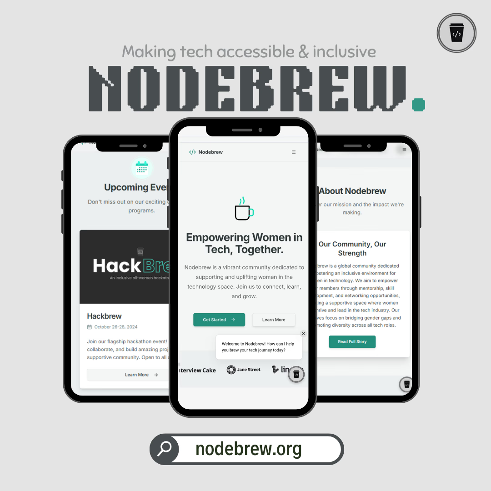
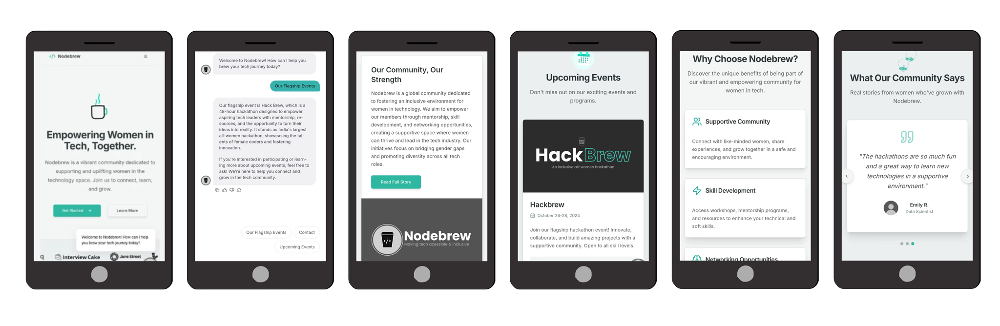

# Nodebrew: Making tech accessible & inclusive
<p align="center">
  
</p>

## About

Nodebrew creates a welcoming space where women in tech can connect, learn, and thrive. Our mission is to foster growth, innovation, and leadership through the power of community.

## Core Values

- **Inclusivity**: Creating a welcoming environment for everyone
- **Empowerment**: Providing resources for personal and professional growth
- **Collaboration**: Fostering connections and teamwork
- **Innovation**: Encouraging creative problem-solving and learning

## Features

- Clean, accessible UI with inclusive design principles
- Dynamic sections highlighting flagship programs and speaker sessions
- Integrated chatbot for visitor assistance (FAQs, joining, events)
- Fully responsive layout for all devices and browsers
- Modern React & TypeScript implementation

## Tech Stack

- **Frontend**: React, TypeScript
- **Chatbot**: Chatbase integration
- **Design**: Responsive, accessible UI with inclusive color scheme

## Pages
<p align="center">
  
</p>


## Getting Started

```bash
# Clone the repository
git clone https://github.com/hahaanisha/Nodebrew.git

# Install dependencies
npm install

# Start development server
npm run dev
